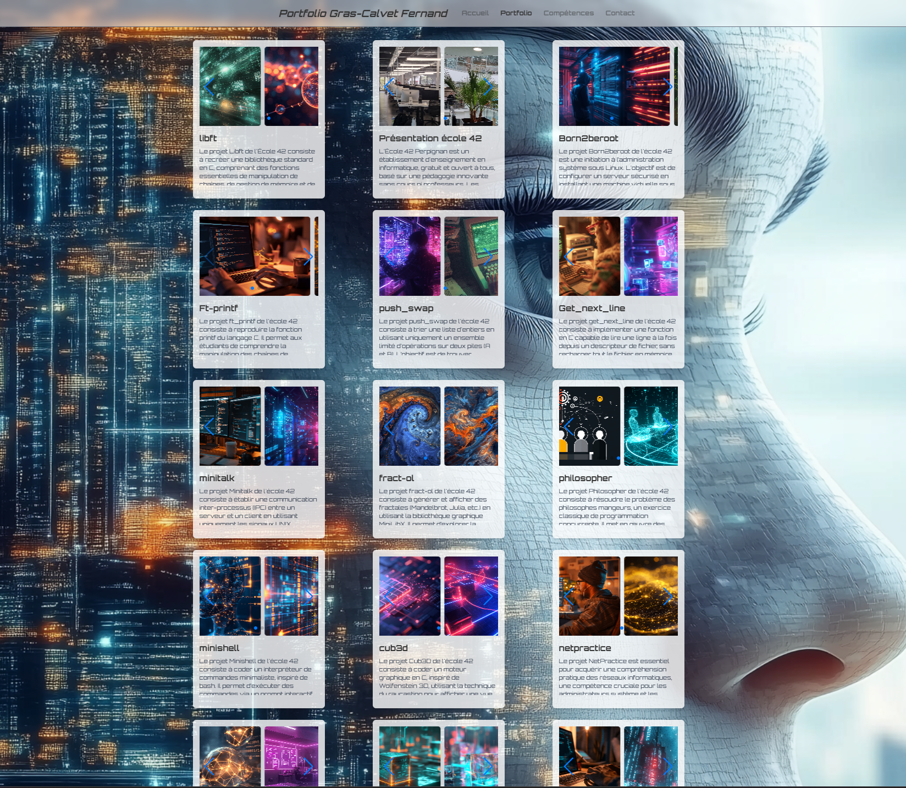

# Portfolio fernandgrascalvet.com



Site portfolio **Next.js 15** + **Strapi 5** + **GrasBot** (FastAPI, Ollama, vault `vault-grasbot/`). UI *Digital Atelier* (Manrope, Newsreader, Tailwind). Hébergement typique : Windows Server, IIS, HTTPS (Win-ACME).

**Site en ligne :** [fernandgrascalvet.com](https://fernandgrascalvet.com)

## Documentation

| Ressource | Rôle |
|-----------|------|
| **[docs-site-interne](docs-site-interne/README.md)** | Architecture, CMS, front, API LLM, feuille de route, état actuel, captures, refonte UI. *À lire en priorité pour le contexte technique.* |
| [`CONFIGURATION_SITE.md`](CONFIGURATION_SITE.md) | Opérationnel : ports, commandes, démarrage automatique, dépannage, pare-feu. |
| [`vault-grasbot/README.md`](vault-grasbot/README.md) | Base de connaissances GrasBot (retrieval graph + BM25 v3). |

**Obsidian / export** : le dossier [`obsidian-site-docs/`](obsidian-site-docs/) contient le hub, les commandes, **toute** la doc [`docs-site-interne/`](docs-site-interne/) (copie), `CONFIGURATION_SITE.md` et le README dépôt — prêt à ouvrir comme coffre ou à copier. Resynchro : [`obsidian-site-docs/SYNC-DOC.md`](obsidian-site-docs/SYNC-DOC.md).

## Démarrage rapide (Windows)

Depuis la racine du dépôt (adapter le lecteur / chemin si besoin) :

```powershell
# Les trois services : Next, Strapi, FastAPI (fenêtres séparées)
.\start-my-site.ps1
```

```powershell
# Arrêt propre (ports 3000, 1337, 8000)
.\stop-my-site.ps1
```

Détail, ports et commandes manuelles : **[`CONFIGURATION_SITE.md`](CONFIGURATION_SITE.md)**.

## Stack (résumé)

- **Front** : Next.js (App Router), TypeScript/JS, Tailwind, Swiper, chatbot global (FAB).
- **CMS** : Strapi — `homepage`, `project`, `competence`, `realisation-ia`, `glossaire`.
- **Contact** : e-mail via **Brevo** (route Next `POST /api/contact`), pas de stockage Strapi des messages. Voir [`docs-site-interne/contact-flow.md`](docs-site-interne/contact-flow.md).
- **IA** : `llm-api/` (FastAPI) → Ollama (ex. Qwen3), base `vault-grasbot/`, observabilité **Langfuse** optionnelle. Voir [`docs-site-interne/04-api-llm-et-chatbot.md`](docs-site-interne/04-api-llm-et-chatbot.md).

## Rechargement du vault GrasBot (API locale)

Après modification des fichiers dans `vault-grasbot/`, recharger le cache côté API sans redémarrer uvicorn :

```powershell
# Exemple (Invoke-RestMethod)
Invoke-RestMethod -Method Post -Uri "http://localhost:8000/reload-vault"
```

Ou : `POST http://localhost:8000/reload-vault` (HTTP client de votre choix). Voir aussi [`CONFIGURATION_SITE.md`](CONFIGURATION_SITE.md) (santé `/health`, endpoint `/ask`).

## Dépôts et répertoires utiles

```
my-next-site/
├── app/                 # Next.js
├── cmsbackend/          # Strapi
├── llm-api/             # FastAPI + GrasBot
├── vault-grasbot/       # Connaissance (Obsidian) pour le retrieval
├── strapi_extraction/   # Extraction / build vault
├── docs-site-interne/   # Doc technique détaillée
├── obsidian-site-docs/  # Pack Obsidian (résumés + commandes)
├── start-my-site.ps1
├── stop-my-site.ps1
└── CONFIGURATION_SITE.md
```

## Licence et usage

Projet personnel ; contenu et code sont fournis tels quels pour illustration du portfolio.

---

*Dernière révision du README : 2026-04 — aligné sur `docs-site-interne` et `CONFIGURATION_SITE.md`.*

Pour lancer tâches planifiées: taskschd.msc

LANGFUSE_SECRET_KEY="sk-lf-7f3cbead-71eb-49b4-8f05-9b7ea57765aa"
LANGFUSE_PUBLIC_KEY="pk-lf-1ed91915-97d3-4b6b-a903-dd8473b3efba"
LANGFUSE_BASE_URL="https://langfuse.fernandgrascalvet.com"