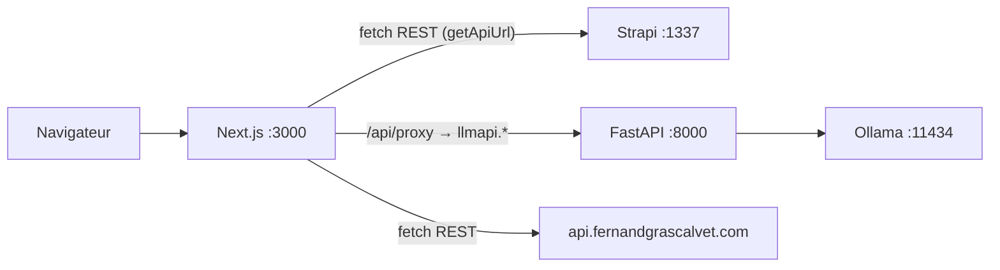

# Architecture globale

**Dernière mise à jour :** 2026-04-01

## Schéma logique

En **développement local**, le front appelle souvent **Strapi sur `localhost:1337`** (voir `getApiUrl`). En **production**, les appels client pointent vers **`https://api.fernandgrascalvet.com`**.

Le **chatbot** ne parle pas à FastAPI en local par défaut : la route `app/api/proxy/route.js` appelle **`https://llmapi.fernandgrascalvet.com/ask`** (URL absolue).

## Services et ports

| Service | Port local typique | Rôle |
|---------|-------------------|------|
| Next.js | 3000 | Site public, rewrites `/api/*` → Strapi distant (voir `next.config.ts`) |
| Strapi | 1337 | CMS, REST `/api/*` |
| FastAPI (`llm-api/api.py`) | 8000 | Pont HTTP vers Ollama `/api/generate` |
| Ollama | 11434 | Inférence LLM (modèle `mistral` dans le code actuel) |

## Fichiers clés

- `next.config.ts` — rewrites, `NEXT_PUBLIC_API_URL`, domaines images.
- `app/utils/getApiUrl.ts` — choix de l’URL Strapi (local vs prod, client vs serveur).
- `app/api/proxy/route.js` — proxy vers l’API LLM **hébergée** (`llmapi.fernandgrascalvet.com`).
- `llm-api/api.py` — implémentation FastAPI locale (Ollama).

## Points d’attention

1. **`next.config` rewrites** : les requêtes vers `/api/*` côté Next sont renvoyées vers l’URL Strapi configurée — **conflit sémantique** avec la route Next `app/api/proxy` (chemin différent : le proxy est sous `/api/proxy`, pas sous le rewrite générique de la même façon ; à vérifier selon l’ordre de matching Next).
2. **`app/utils/config.ts`** expose `API_URL` avec défaut `localhost:1337`, alors que `next.config.ts` utilise par défaut le domaine de prod : usages distincts, ne pas les confondre.
